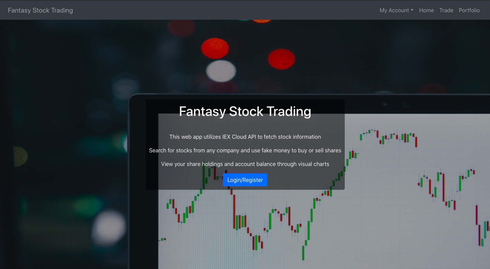
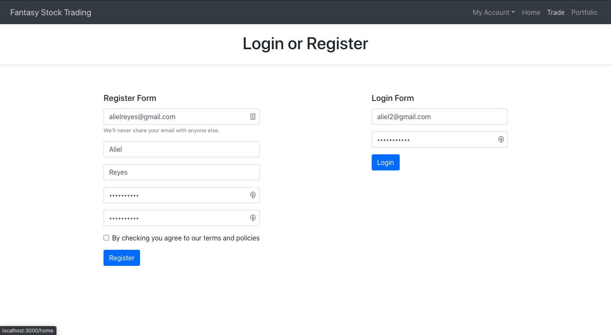
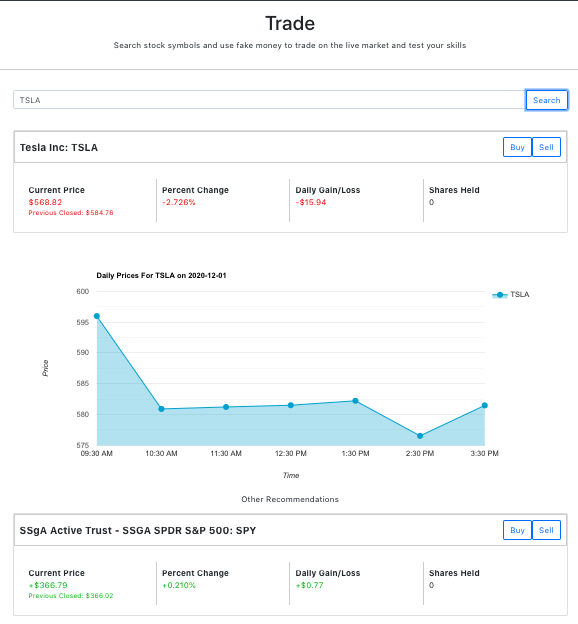
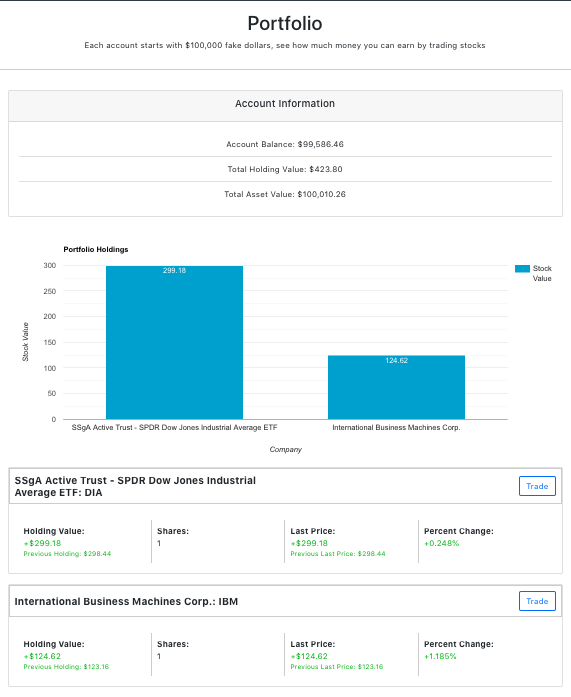

# Fantasy Stock Trading

Try it out! [Application Link](https://ar-fantasy-stock.herokuapp.com/)

Use fake money to trade stock shares from your favorite companies.

###### For Installation Instructions:

[Installation Instructions](./INSTALL.md)

###### Home Page

###### Login Page

###### Trade Page

###### Portfolio Page

## Description

This project utilizes the IEX Cloud API to fetch stock information, which communicates with my internal API using Nodejs and Expressjs. In this application, users can register or log in to their account, which uses fake money stored on my database to buy or sell shares from various companies. It also uses visuals from the Google graphs library to help the user make the most out of trading shares.

Working on this project has been a very challenging endeavor. When I first started mapping out the project, I did not know anything about how the stock market worked. The first week was getting acquainted with the stock market and learning what it means to trade shares. Afterward, I built the front-end using React to structure the project. I also mocked any API data using promises to emulate the final product.

The second challenge was then authenticating the user. I ended up creating a custom authentication system, which required using two tables on my database. The first table was to create a user profile and store user information such as name, email, etc. The second table is then used for creating a user session per login. Every session created had an expiration date, which logs the user out if they have gone over. The session-id was added to the header through each HTTP request, allowing me to figure out if the session was valid or expired.

I also learned about form validation for the front-end and the backend since the front-end can be easily bypassed if the person knows what they are doing. I utilized the express-validator package for the backend and made my validations for the front-end.

It was also the first time I implemented unit tests for my backend code. I focused on the backend to ensure that the transactions are error-free from any future mistakes. It resulted in separating my code more than usual to simplify the tests. It ended up simplifying the logic and improved the overall file organization.

All in all, this has been a wild ride and a behemoth of a project. I went through all kinds of emotions while working on this project. At times it was fun, and at other frustrating. I've learned a ton from this project, and even now, I can still see ways to improve it. However, this is currently a working product, and after a few months of working on this project, I am excited to tackle my next challenge.

## Technologies/Design

###### Technology Stack

- HTML, CSS, JavaScript - Front End Stack
- React - Front End Framework
- Node.js and Express.js - Backend Stack and Internal API
- Postgre SQL - Database
- IEX Cloud API - RESTAPI
- Heroku - Hosting platform for both the web server and database

###### Other Tools

- Google's Draw.IO to help with initial project design and structure. [Diagram](https://drive.google.com/file/d/1UrLda1p3zZE7E3APX58-x-vgD99OsNIC/view?usp=sharing)

NOTE: This diagram only shows the steps taken before starting the project. Does not represent final draft.

## Author

- Aliel Reyes - Software Developer [Github](https://github.com/Areyesfigueroa) | [LinkedIn](https://www.linkedin.com/in/alielreyes/) | [Website](https://alielreyes.netlify.app/)
